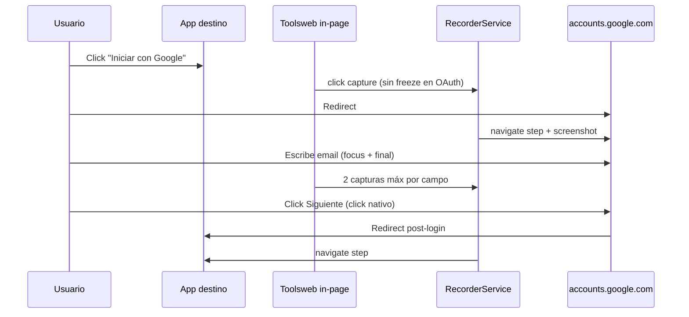
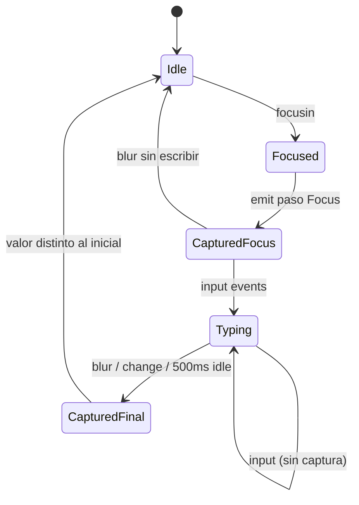
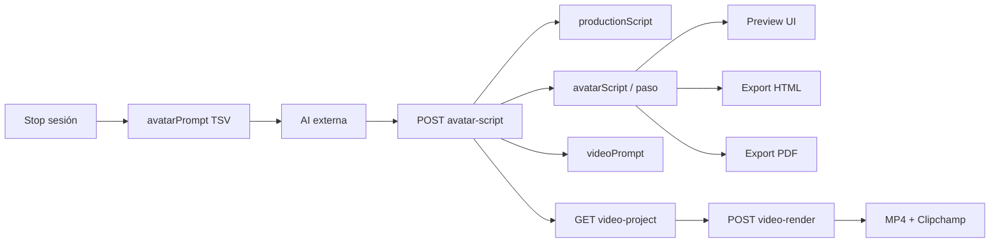
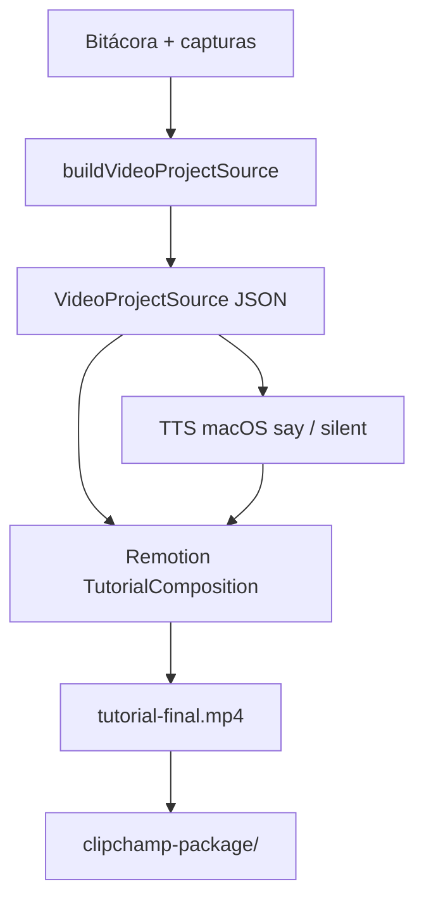
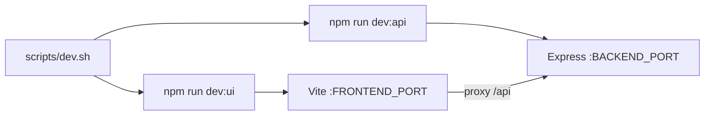

# Toolsweb — Architecture (runtime descriptivo)

Documento **descriptivo** del runtime actual. No sustituye `specifications/` ni ADRs.

## Objetivo

Capturar acciones de navegación web y exportar:

1. Tutoriales HTML5 / PDF (con subtítulos de narración si hay guión).
2. Prompt de avatar estilo Synthesia (TSV) para cualquier AI externa (ADR-0003).
3. Prompt de producción de video (`videoPrompt`, UC-0008).
4. Video MP4 local + paquete Clipchamp (UC-0009 / ADR-0007).

Destino de captura: **WebExtensions** (ADR-0004). Playwright + Express es **bridge** temporal.

## Vista general del sistema

```mermaid
flowchart TB
  subgraph author [Autor]
    UI[Frontend React :5173]
    PW[Playwright browser]
  end

  subgraph backend [Backend Express :4410]
    R[routes]
    RS[RecorderService]
    SL[SessionLogService]
    EX[Html/Pdf Exporters]
    VP[VideoProjectSource + Jobs]
  end

  subgraph pkgs [Paquetes]
    SH[@toolsweb/shared]
    VR[@toolsweb/video-renderer]
  end

  subgraph disk [Disco gitignored]
    CAP[captures/]
    LOG[data/sessions/]
    VID[exports/video/]
  end

  UI -->|HTTP /api| R
  R --> RS
  R --> SL
  R --> EX
  R --> VP
  RS --> PW
  RS --> CAP
  SL --> LOG
  VP --> VR
  VR --> VID
  RS --> SH
  SL --> SH
  UI --> SH
```

## Monorepo (npm workspaces)

| Package | Nombre npm | Rol |
|---------|------------|-----|
| `packages/shared` | `@toolsweb/shared` | Zod, privacy, narración, `buildVideoProjectSource`, sticky menu modules |
| `packages/backend` | `@toolsweb/backend` | Express API + Playwright recorder + export + video jobs |
| `packages/frontend` | `@toolsweb/frontend` | UI bitácora / preview / guión / video |
| `packages/video-renderer` | `@toolsweb/video-renderer` | MP4 Remotion + TTS macOS/silent + Clipchamp (ADR-0007) |
| `apps/extension` | `@toolsweb/extension` | WebExtensions MV3 (EventRecorder + popup) |
| `apps/studio` | `@toolsweb/studio` | Edición `ActionSession` |
| `scripts/dev.sh` | — | Levantar / reiniciar API + UI |

## Capas backend (bridge)

```
routes (Express) → services → Playwright / filesystem / video-renderer
```

| Service / módulo | Responsabilidad |
|------------------|-----------------|
| `RecorderService` | Sesión Playwright, cola in-page, highlight, screenshot → `CaptureStep` |
| `MetadataExtractor` | Metadata semántica — gated por `ENABLE_AVATAR_SCRIPT` (UC-0003/0004) |
| `AvatarPromptService` | `avatarPrompt` al stop: tabla TSV Synthesia 1:1 por paso (UC-0004) |
| `importAvatarScript` | Pega AI → `productionScript` + `fullScript` + subtítulos + `videoPrompt` |
| `VideoProductionPromptService` | `videoPrompt` (guión + timeline) — UC-0008 |
| `VideoProjectSourceService` | Sesión → JSON fuente Remotion (UC-0009) |
| `videoRenderJobs` | Jobs async de render MP4 |
| `SessionLogService` | Bitácora cifrada; purge completo UC-0010 |
| `HtmlExporterService` / `PdfExporterService` | Export con subtítulos |
| `recorder/captureInitScript.ts` | JS plano inyectado (ADR-0002) |
| `recorder/authHostPageScript.ts` | Detección OAuth in-page (sin freeze) |
| `lib/blankScreenshot.ts` | PNG ≥90% uniforme |

Artefactos en disco:

| Ruta | Contenido |
|------|-----------|
| `packages/backend/captures/<id>/` | PNG capturas `[.enc]` |
| `packages/backend/data/sessions/` | Bitácora `<id>.json.enc` |
| `packages/backend/data/browser-profiles/` | Perfiles Playwright |
| `exports/video/<id>/` | MP4, storyboard, Clipchamp package |

## Proceso de grabación (bridge)

```mermaid
flowchart TD
  start[POST /sessions/start] --> open[Playwright + init scripts + binding]
  open --> loop{Gestos en página}

  loop --> click[click / pointerdown]
  loop --> field[focus / input / blur]
  loop --> nav[framenavigated]

  click --> oauthHost{Host OAuth?}
  oauthHost -->|sí| noFreeze[Sin freeze — click nativo]
  oauthHost -->|no| maybeFreeze[Freeze si navega]
  maybeFreeze --> queue
  noFreeze --> queue[Cola __toolswebQueue]

  field --> coalesce[Input: focus + valor final]
  coalesce --> queue

  nav --> navQueue[Encolar navigate aunque haya shot activo]
  navQueue --> queue

  queue --> drain[Drain Node ~80 ms]
  drain --> paint[Highlight + cursor]
  paint --> ready[waitForCaptureReady]
  ready --> shot[screenshot viewport]
  shot --> blank{navigate blank?}
  blank -->|sí, no OAuth| skip[Descarta paso]
  blank -->|no u OAuth| save[CaptureStep + PNG]
  skip --> loop
  save --> loop

  loop --> stop[Stop UI Toolsweb]
  stop --> prompt[avatarPrompt TSV]
  prompt --> log[Bitácora cifrada]
```

### Calidad de captura (UC-0002)

| Regla | Detalle |
|-------|---------|
| Densidad | Por **gesto**, no FPS de video |
| Cola | Poll ~80 ms (`CAPTURE_QUEUE_DRAIN_MS`) |
| Clicks | Highlight sincronizado; freeze solo fuera de OAuth |
| Input | **2 capturas/campo**: focus + valor final (blur o 500 ms idle) |
| Navigate | Blank-skip ≥90% uniforme **excepto** OAuth |
| OAuth | Sin freeze; settle 8 s; imágenes conservadas; metadatos sanitizados |

### OAuth / Google login



Recomendación: `browser: chrome` + `persistentProfile: true`.

## Coalescing de campos de texto



## Flujo guión → export → video



### Pipeline video local (UC-0009)



CLI alternativo:

```bash
npm run video:validate -- --session <uuid>
npm run video:build -- --session <uuid> [--silent]
```

## Dev stack



```bash
npm run dev:stack          # start (reinicia si puertos ocupados)
npm run dev:stack:status
npm run dev:stack:stop
```

Logs: `.toolsweb/logs/`.

## API actual

| Method | Path | Notas |
|--------|------|-------|
| `POST` | `/api/sessions/start` | `StartSessionRequest` |
| `POST` | `/api/sessions/stop` | Bitácora + `avatarPrompt` |
| `POST` | `/api/sessions/force-stop` | Grabación huérfana |
| `GET` | `/api/sessions` | Lista + `activeSessionId` |
| `GET` | `/api/sessions/:sessionId` | `?withImages=1` |
| `POST` | `/api/sessions/:sessionId/avatar-script` | Import guión |
| `DELETE` | `/api/sessions/:sessionId` | Purge bitácora + capturas + video (UC-0010) |
| `GET` | `/api/sessions/:id/video-project` | Fuente Remotion |
| `POST` | `/api/sessions/:id/video-render` | Job async MP4 |
| `GET` | `/api/sessions/:id/video-render/:jobId` | Estado job |
| `GET` | `/api/sessions/:id/video-preview` | Stream MP4 |
| `GET` | `/api/sessions/:id/video-package` | Ruta Clipchamp |
| `POST` | `/api/export/html` / `pdf` | Desde payload |
| `POST` | `/api/export/html\|pdf/:sessionId` | Desde bitácora |
| `GET` | `/health` | Liveness |

## Frontend

- Sesión Playwright, bitácora, preview (UC-0001), guión, video tutorial.
- Proxy Vite → backend vía `VITE_BACKEND_URL` o host/port `.env`.

## Configuración (`.env`)

| Variable | Default | Uso |
|----------|---------|-----|
| `BACKEND_HOST` / `BACKEND_PORT` | `127.0.0.1` / `4410` | API |
| `FRONTEND_HOST` / `FRONTEND_PORT` | `127.0.0.1` / `5173` | Vite UI |
| `STUDIO_HOST` / `STUDIO_PORT` | `127.0.0.1` / `5174` | Studio |
| `VITE_BACKEND_URL` | derivado | Proxy `/api` |
| `CORS_ORIGIN` | derivado frontend | CSV opcional |
| `CAPTURE_QUEUE_DRAIN_MS` | `80` | Poll cola (ms) |
| `CAPTURE_HIGHLIGHT_HOLD_MS` | `90` | Highlight pre-shot (ms) |
| `CAPTURE_AUTH_NAVIGATE_TIMEOUT_MS` | `8000` | Settle OAuth (ms) |
| `TOOLSWEB_ENCRYPTION_KEY` | requerida | AES-256-GCM |
| `ENABLE_AVATAR_SCRIPT` | `true` | Metadata + prompt |
| `VIDEO_TTS_*` | ver `.env.example` | TTS renderer |

Valores con espacios o paréntesis **entre comillas** (ej. `VIDEO_TTS_VOICE="Paulina (Enhanced)"`).

Playwright: `dev`/`start` del backend usan `env -u PLAYWRIGHT_BROWSERS_PATH`.

## Specs relacionadas

| Id | Tema |
|----|------|
| UC-0001…0011 | `specifications/uc/` |
| ADR-0001…0008 | `specifications/adr/` |
| ASSUMP-0001 | sesión única activa |
| PRIVACY | `docs/PRIVACY.md` |

## Stack

TypeScript strict, Node ≥ 20, Express 4, Playwright, Zod, Handlebars, Remotion, React 18, Vite 5.

## Límites conocidos

- Una grabación Playwright activa por proceso API (ASSUMP-0001).
- Bridge: selectores heurísticos; screenshots viewport.
- TTS local: macOS `say` o modo silent.
- Extensión: pack Firefox / preview bbox pendiente (ROADMAP).
