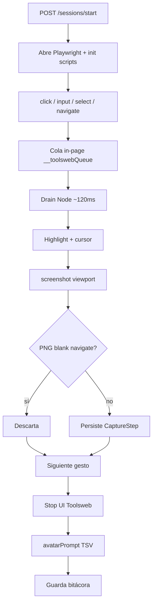
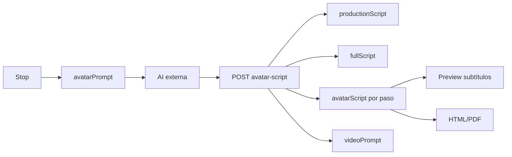

# Toolsweb — Architecture (runtime descriptivo)

Documento **descriptivo** del runtime actual. No sustituye `specifications/` ni ADRs.

## Objetivo

Capturar acciones de navegación web y exportar:

1. Tutoriales HTML5 / PDF (con subtítulos de narración si hay guión).
2. Prompt de avatar estilo Synthesia (TSV) para cualquier AI externa (ADR-0003).
3. Prompt de producción de video (`videoPrompt`, UC-0008).

Destino de captura: **WebExtensions** (ADR-0004). Playwright + Express es **bridge** temporal.

## Monorepo (npm workspaces)

| Package | Nombre npm | Rol |
|---------|------------|-----|
| `packages/shared` | `@toolsweb/shared` | Zod (`CaptureStep`, `TutorialAction`, mensajes extensión), privacy, narración, `distributeSpokenToSteps` |
| `packages/backend` | `@toolsweb/backend` | Express API + Playwright recorder + export HTML/PDF + prompts |
| `packages/frontend` | `@toolsweb/frontend` | UI bitácora / preview / guión / video prompt |
| `apps/extension` | `@toolsweb/extension` | WebExtensions MV3 (EventRecorder + popup) |
| `apps/studio` | `@toolsweb/studio` | Edición `ActionSession` (Vite :5174) |

## Capas backend (bridge)

```
routes (Express) → services → Playwright / filesystem
```

| Service / módulo | Responsabilidad |
|------------------|-----------------|
| `RecorderService` | Sesión Playwright, cola in-page, highlight, screenshot → `CaptureStep` |
| `MetadataExtractor` | Metadata semántica — gated por `ENABLE_AVATAR_SCRIPT` (UC-0003/0004) |
| `AvatarPromptService` | `avatarPrompt` al stop: pide tabla TSV Synthesia 1:1 por paso (UC-0004) |
| `importAvatarScript` | Pega AI → `productionScript` + `fullScript` + `steps[].avatarScript` + `videoPrompt` |
| `VideoProductionPromptService` | `videoPrompt` (guión + timeline de pantallas) — UC-0008 |
| `SessionLogService` | Bitácora cifrada; recupera `productionScript` desde guía en `videoPrompt` si falta |
| `HtmlExporterService` | HTML5 con subtítulo de narración por captura |
| `PdfExporterService` | HTML → PDF vía Chromium headless (`page.pdf()`) |
| `lib/blankScreenshot.ts` | Detecta PNG ≥90% uniforme |
| `recorder/captureReady.ts` | Estabilización pre-screenshot |
| `recorder/captureInitScript.ts` | JS plano inyectado (ADR-0002) |

Artefactos en disco:

- Capturas: `packages/backend/captures/<sessionId>/step-NNN.png[.enc]` (gitignored)
- Bitácora: `packages/backend/data/sessions/<id>.json.enc`
- Perfiles browser: `packages/backend/data/browser-profiles/<browser>/` (gitignored)

## Grabación (flujo bridge)



### Calidad de captura (UC-0002)

1. Gestos encolados en página; Node drena con ack de freeze.
2. Clicks: highlight sincronizado con el shot (sin race que limpie el anillo).
3. Navigate: estabilización; blank skip solo en navigate cuando aplica.
4. Stop solo desde UI Toolsweb.

### Perfil de browser y login

| Opción start | Efecto |
|--------------|--------|
| `browser` | `chrome` \| `chromium` \| `firefox` \| `webkit` (default `chrome`) |
| `persistentProfile: true` (default) | Cookies en `data/browser-profiles/<browser>/` |
| `freshLogin: true` | Contexto efímero; no borra el perfil persistente |

## Flujo guión / video



- Tabla TSV detectada → subtítulos por `stepNumber`; locución limpia en `fullScript`.
- Texto plano → párrafos a pasos interactivos.
- Al Abrir sesión, el textarea restaura `productionScript` (o `fullScript`).

## API actual

| Method | Path | Notas |
|--------|------|-------|
| `POST` | `/api/sessions/start` | `StartSessionRequest` |
| `POST` | `/api/sessions/stop` | Bitácora + `avatarPrompt` |
| `POST` | `/api/sessions/force-stop` | Grabación huérfana |
| `GET` | `/api/sessions` | Lista + `activeSessionId` |
| `GET` | `/api/sessions/:sessionId` | `?withImages=1`; refresca prompt Synthesia si legacy |
| `POST` | `/api/sessions/:sessionId/avatar-script` | Import guión |
| `DELETE` | `/api/sessions/:sessionId` | Borra bitácora + capturas |
| `POST` | `/api/export/html` / `pdf` | Payload session |
| `POST` | `/api/export/html\|pdf/:sessionId` | Desde bitácora |
| `GET` | `/health` | Liveness |

Puertos: API `127.0.0.1:4410`, UI `127.0.0.1:5173`, Studio `5174`.

## Frontend

- Sesión, bitácora, preview (UC-0001) con subtítulos.
- Copiar `avatarPrompt` / pegar guión / copiar `videoPrompt`.
- Export HTML/PDF con narración.

## Configuración (`.env`)

| Variable | Default | Uso |
|----------|---------|-----|
| `BACKEND_HOST` / `BACKEND_PORT` | `127.0.0.1` / `4410` | API |
| `FRONTEND_HOST` / `FRONTEND_PORT` | `127.0.0.1` / `5173` | Vite UI |
| `VITE_BACKEND_URL` | derivado | Proxy `/api` |
| `TOOLSWEB_ENCRYPTION_KEY` | requerida | AES-256-GCM |
| `ENABLE_AVATAR_SCRIPT` | `true` | Metadata + prompt al stop |

Playwright: `dev`/`start` del backend ejecutan con `env -u PLAYWRIGHT_BROWSERS_PATH` para evitar el cache sandbox de Cursor.

## Specs relacionadas

| Id | Path |
|----|------|
| UC-0001…0008 | `specifications/uc/` |
| ADR-0001…0006 | `specifications/adr/` |
| ASSUMP-0001 | sesión única activa |
| PRIVACY | `docs/PRIVACY.md` |

## Stack

- TypeScript strict, Node ≥ 20, Express 4, Playwright, Zod, Handlebars, `pngjs`
- React 18, Vite 5, Tailwind 3; extensión `@crxjs`

## Límites conocidos

- Una sola grabación Playwright activa por proceso API (ASSUMP-0001).
- Bridge: selectores heurísticos; screenshots viewport.
- Extensión: pack Firefox / preview bbox pendiente (ROADMAP).
- `networkidle` best-effort en SPAs.
