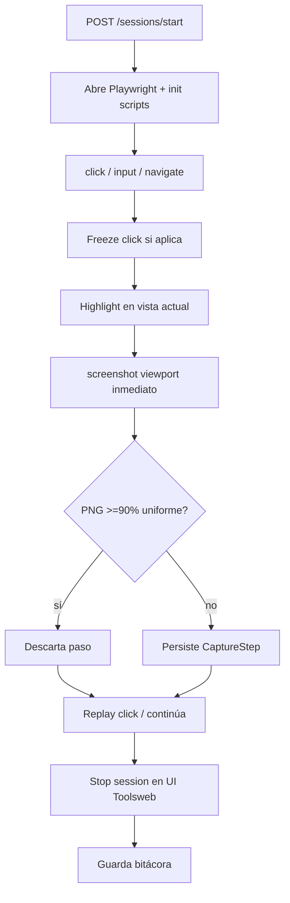

# Toolsweb — Architecture (runtime descriptivo)

Documento **descriptivo** del runtime actual. No sustituye `specifications/` ni ADRs.

## Objetivo

Capturar acciones de navegación web (clicks, inputs, screenshots) y exportar tutoriales HTML5 standalone y PDF de alta calidad.

## Monorepo (npm workspaces)

| Package | Nombre npm | Rol |
|---------|------------|-----|
| `packages/shared` | `@toolsweb/shared` | Tipos + Zod (`CaptureStep`, `TutorialSession`, requests) |
| `packages/backend` | `@toolsweb/backend` | Express API + Playwright (recorder + PDF) + Handlebars HTML |
| `packages/frontend` | `@toolsweb/frontend` | UI Vite + React + Tailwind (control de sesión / bitácora / preview) |

## Capas backend

```
routes (Express) → services → Playwright / filesystem
```

| Service / módulo | Responsabilidad |
|------------------|-----------------|
| `RecorderService` | Sesión Playwright, listeners DOM, highlight, settle, screenshot → `CaptureStep` |
| `MetadataExtractor` | Metadata semántica del target — gated por `ENABLE_AVATAR_SCRIPT` (UC-0003/0004) |
| `AvatarPromptService` | Arma `avatarPrompt` al stop (sin APIs LLM) — UC-0004 |
| `SessionLogService` | Bitácora cifrada en disco |
| `HtmlExporterService` | `TutorialSession` → HTML5 standalone (Handlebars + Tailwind CDN) |
| `PdfExporterService` | HTML → PDF vía `page.pdf()` |
| `lib/blankScreenshot.ts` | Detecta PNG ≥90% uniforme (omite el paso) |
| `recorder/captureReady.ts` | Espera estabilización antes del screenshot |
| `recorder/captureInitScript.ts` | JS plano inyectado (listeners, cursor, highlight) |

Captura en página: `services/recorder/captureInitScript.ts` exporta **string JS plano** (`CAPTURE_INIT_SCRIPT`) — ver ADR-0002.

Artefactos en disco:

- Capturas: `packages/backend/captures/<sessionId>/step-NNN.png[.enc]` (gitignored)
- Bitácora: `packages/backend/data/sessions/<id>.json.enc`
- Perfiles browser: `packages/backend/data/browser-profiles/<browser>/` (gitignored)

## Grabación (flujo)



### Highlights

- Caja alrededor del target (click = rojo, focus/input = verde).
- En clicks: **icono SVG de cursor** en el punto (`clientX/Y`), no un círculo.
- Re-pintado desde Node justo antes del shot para sincronizar frame.

### Clicks y scroll

- **Freeze** (`preventDefault` + replay) en la mayoría de clicks para capturar el frame **pre-navegación** con highlight; luego se reproduce el gesto.
- Excepciones nativas: checkbox / radio / file / range / select (y labels asociadas) — gesto inmediato.
- Scrollbars no se interceptan.
- Clicks en highlight Toolsweb no generan pasos.

### Calidad de captura (UC-0002)

1. **Clicks**: freeze del gesto → highlight → screenshot **instantáneo** (sin esperar networkidle) → replay. Así el highlight coincide con la pantalla del evento, no con la siguiente.
2. **Navigate**: estabilización larga (carga / red / animaciones).
3. **Omitir vacíos**: `isMostlyBlankPng` — si ≥90% de muestras caen en el mismo bucket de color, no se guarda el paso.
4. **Stop**: solo desde la UI Toolsweb (`Stop session`). Sin panel flotante en el browser grabado.

### Perfil de browser y login

| Opción start | Efecto |
|--------------|--------|
| `browser` | `chrome` \| `chromium` \| `firefox` \| `webkit` (default `chrome`) |
| `persistentProfile: true` (default) | Cookies en `data/browser-profiles/<browser>/` |
| `freshLogin: true` | Contexto **efímero** (pide login / cambiar usuario); no borra el perfil persistente |

`chrome` + canal instalado mejora OAuth Google frente a Chromium embebido.

### Detener la grabación

- Stop desde la UI Toolsweb (`POST /api/sessions/stop`).
- La UI detecta fin de grabación vía poll de `GET /api/sessions`.

## API actual

| Method | Path | Notas |
|--------|------|-------|
| `POST` | `/api/sessions/start` | Body Zod `StartSessionRequest` (`freshLogin`, `persistentProfile`, …) |
| `POST` | `/api/sessions/stop` | Cierra browser; guarda bitácora; `TutorialSession` |
| `POST` | `/api/sessions/force-stop` | Recupera grabación huérfana |
| `GET` | `/api/sessions` | Bitácora + `activeSessionId` / `recording` |
| `GET` | `/api/sessions/:sessionId` | Live o bitácora; `?withImages=1` hidrata `imageBase64` |
| `DELETE` | `/api/sessions/:sessionId` | Elimina bitácora + capturas |
| `POST` | `/api/export/html` | Attachment `.html` (payload session) |
| `POST` | `/api/export/pdf` | Attachment `.pdf` |
| `POST` | `/api/export/html/:sessionId` | HTML desde bitácora |
| `POST` | `/api/export/pdf/:sessionId` | PDF desde bitácora |
| `GET` | `/health` | Liveness |

Puertos por defecto: API `127.0.0.1:4410`, UI `127.0.0.1:5173` (proxy `/api`).

## Frontend

- Control de sesión, bitácora (abrir / exportar / eliminar).
- **Step preview** (UC-0001): diapositiva por paso, teclado, fullscreen.
- Sync de estado al detener desde la UI.

## Configuración (`.env`)

Ver `.env.example` en la raíz:

| Variable | Default | Uso |
|----------|---------|-----|
| `BACKEND_HOST` / `BACKEND_PORT` | `127.0.0.1` / `4410` | API Express |
| `FRONTEND_HOST` / `FRONTEND_PORT` | `127.0.0.1` / `5173` | Vite UI |
| `VITE_BACKEND_URL` | derivado de backend | Proxy Vite → API |
| `TOOLSWEB_ENCRYPTION_KEY` | *(requerida para bitácora)* | AES-256-GCM at-rest (`openssl rand -hex 32`) |

## Specs relacionadas

| Id | Path |
|----|------|
| UC-0001 | `specifications/uc/UC-0001-step-preview.md` |
| UC-0002 | `specifications/uc/UC-0002-capture-quality-and-in-browser-stop.md` |
| ADR-0002 | `specifications/adr/ADR-0002-playwright-plain-js-injection.md` |
| ASSUMP-0001 | `specifications/assumptions/ASSUMP-0001-single-active-session.md` |

## Stack

- TypeScript strict, Node ≥ 20, Express 4, Playwright, Zod, Handlebars, `pngjs`
- React 18, Vite 5, Tailwind 3

## Límites conocidos (baseline)

- Una sola sesión de grabación activa en memoria por proceso API (ASSUMP-0001).
- Selectores DOM heurísticos (id / data-testid / name / path corto).
- Screenshots viewport (no fullPage por defecto).
- Passwords: valor no se muestra en claro en descripciones de step.
- `networkidle` no siempre ocurre en SPAs; la estabilización es best-effort + omisión de frames uniformes.
